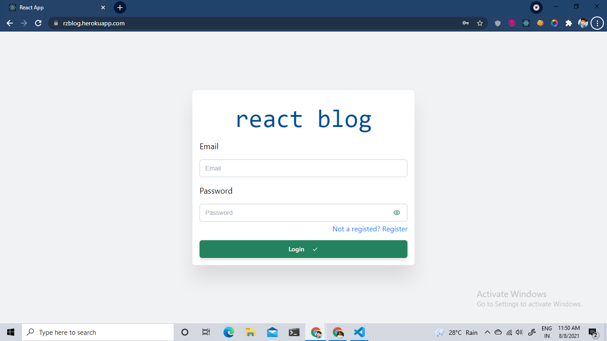
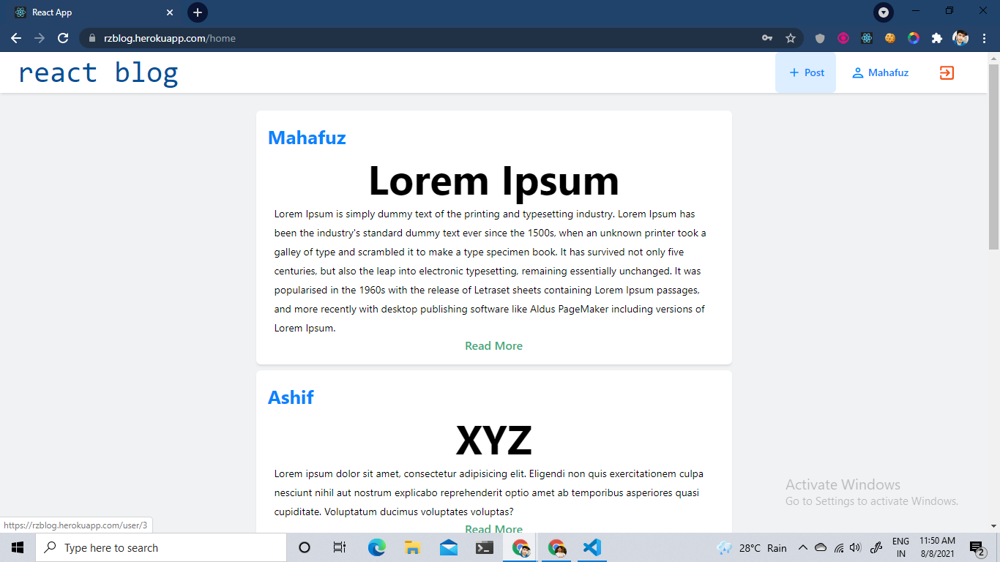
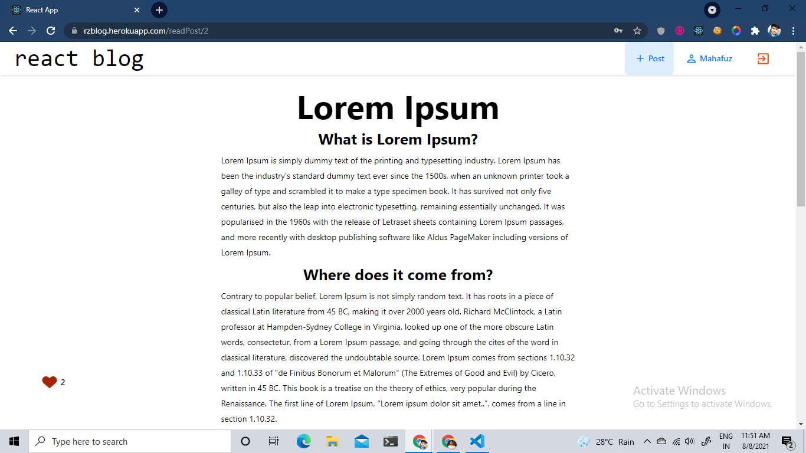
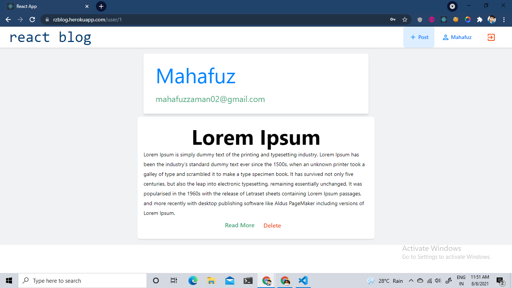

# React Blog
Deployed on heroku server [Demo Link](https://rzblog.herokuapp.com/)
[Backend Code](https://github.com/Zaman3027/reactBlogBackend)

* JWT token for authorization.
* Create Post, Delete Post, Give Like.
* For backend have used Node js and Express
* For database have used Postgresql

# Run on your instance

* Step 1

```
git clone https://github.com/Zaman3027/reactBlog.git 
git clone https://github.com/Zaman3027/reactBlogBackend.git

```

run **npm i** in both directory.

* Step 3

Import the schema of database present in reactBlogBackend/database.sql

* Step 4

Configure "dbConfig.js" present in reactBlogBackend/dbConfig.js

* Step 5
To run client use command in terminal **npm start** in reactBlog
To run server use command in terminal **npm run dev** in reactBlogBackend


# ScreenSort
## Login Page

Login Page

## Home Page


## Read Page



## Profile Page
